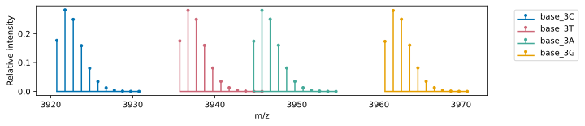
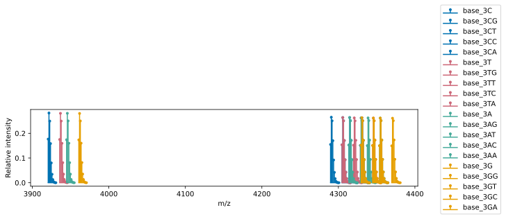
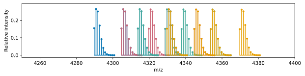
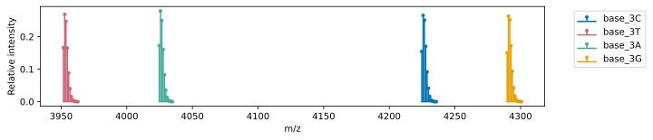
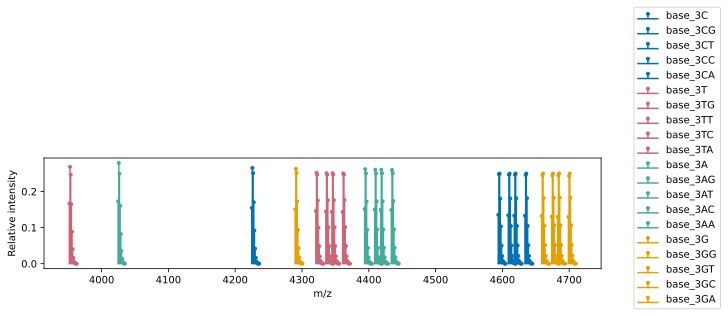
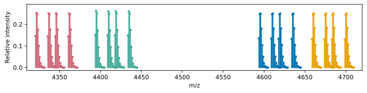
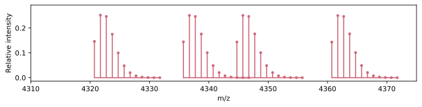

# Planning a MALDI Experiment using the Analyte classes

## Overview

MALDI-ToF can be used to gain insight into any chemical transformation that results in a change in mass. Additionally, multiple transformations can be simultaneously measured, given that the mass of each analyte is mass-resolved from the others.

The `Analyte` classes in MASSIVE can be used to programmatically define and visualize sets of analytes, with well-resolved mass distributions. This is conceptually similar to fluorophore choice when designing a flow cytometry panel.

This guide walks through an example using the `Oligo` class to visualize and refine a panel of oligonucleotides to measure activity in the context of enzymatic DNA synthesis.

---

## Biochemistry context
In this example, we think through a MALDI experiment that tests for DNA polymerization by terminal deoxynucleotidyl transferase (TdT). 

TdT naturally adds non-templated bases to the 3' end of a single-stranded DNA molecule, and is therefore of great interest in the field of enzymatic DNA synthesis.
In order to limit the addition to a single nucleotide for use in sequence-specific synthesis schemes, it is necessary to add some sort of 3' blocker to the nucleotide being added, for example a phosphate group (3'phosphate-dGTP).
However, it is known that the presence of a blocking group on the 3' end of a nucleotide interferes with the enzymatic activity of the enzyme.
It is also known that TdT's enzymatic activity is dependent on both the sequence at the 3' end of the DNA that it is acting on, and the identity of the nuceotide being added.

With all of that in mind, we can imagine that it would be valuable to test for a couple of things simultaneously:
    - The activity of TdT on oligonucleotide substrates with varying 3' end sequences.
    - The activity of TdT with various 3' blocked nucleotides.

With MALDI, it is possible to measure every combination of these two properties simultaneously, assuming that each analyte is mass-resolved from the others. This principle can be extended to any molecular transformation that is mass-resolved.

## Setup

```python
from MASSIVE.analytes import Oligo
import matplotlib.pyplot as plt
```

Here are four nicely differentiated colours for our plots.

```python
blue  = '#0072B2'
pink  = '#CC6677'
green = '#44AA99'
gold  = '#E69F00'

colours = [blue, pink, green, gold]
```

---

## Step 1 — Define the base oligos

We will first define a set of four oligonucleotides that only differ by the 3' terminal base. If we test TdT polymerization on these oligos, we will get some information about its sequence preference.

```python
base_oligos = [
    Oligo(name='base_3C', seq='GAAGACCACAACC'),  # blue
    Oligo(name='base_3T', seq='GAAGACCACAACT'),  # pink
    Oligo(name='base_3A', seq='GAAGACCACAACA'),  # green
    Oligo(name='base_3G', seq='GAAGACCACAACG'),  # gold
]
```

---

## Step 2 — Check the mass distributions of the base oligos

Let's plot these oligos to see if they are mass-resolved.

```python
fig, ax = plt.subplots(figsize=(10, 2))

for i, o in enumerate(base_oligos):
    o.plot(ax=ax, label=o.name, colour=colours[i], mass_labels=False)

ax.legend(bbox_to_anchor=(1.05, 1), loc='upper left')
ax.set_xlabel('m/z')
ax.set_ylabel('Relative intensity')
```




> **Notice:** It's a bit tight, but these oligos are mass-resolved. If you were to run these together on MALDI, you would be able to quantify the relative abundance of each one. Great!

---

## Step 3 — Check for overlap with polymerization products

In our assay, we want to polymerize each of the base oligos with all four dNTPs, and quantify the relative abundance of each product.

Below, we will plot the mass distributions of each oligo and its possible +1 products, with the colour corresponding to the base oligo.

We can add a 3'phosphate to the products, given that the experiment will use 3'phosphate-dNTPs.

```python
fig, ax = plt.subplots(figsize=(10, 2))

polymerization_options = ['G', 'T', 'C', 'A']

for i, o in enumerate(base_oligos):

    o.plot(ax=ax, label=o.name, colour=colours[i], mass_labels=False)

    for N in polymerization_options:
        o_pol = Oligo(seq=o.seq + N, name=f"{o.name}{N}", mods=[o.mods, '3P'])
        o_pol.plot(ax=ax, label=o_pol.name, colour=colours[i], mass_labels=False)

ax.legend(bbox_to_anchor=(1.05, 1), loc='upper left')
ax.set_xlabel('m/z')
ax.set_ylabel('Relative intensity')
```






> **Yikes!** The peaks from the polymerization reactions are overlapping. It would not be possible to work with this data.

---

## Step 4 — Redesign to resolve conflicts

Fortunately, oligos can be readily synthesized with a variety of modifications, giving a lot of flexibility for where the masses will fall.

In the example below, we have made some minimal changes to the base oligos:

| Oligo | Modification            | Mass shift (Da) | Approx cost (USD) |
|-------|-------------------------|-----------------|-------------------|
| 3'C   | 5' dT                   | ~320            | <$1               |   
| 3'T   | 1 phosphorothioate bond | ~16             | $4.50             |
| 3'A   | 5' phosphate            | ~80             | $30               |  
| 3'G   | 5' dG                   | ~350            | <$1               |

```python
base_oligos = [
    Oligo(name='base_3C', seq='TGAAGACCACAACC', mods=None),
    Oligo(name='base_3T', seq= 'GAAGACCACAACT', mods='PS'),
    Oligo(name='base_3A', seq= 'GAAGACCACAACA', mods='5P'),
    Oligo(name='base_3G', seq='GGAAGACCACAACG', mods=None),
]
```



---

## Step 5 — Re-run the polymerization check

Now, let's visualize what the polymerization products look like with the new oligos. 

```python
fig, ax = plt.subplots(figsize=(10, 2))

for i, o in enumerate(base_oligos):

    o.plot(ax=ax, label=o.name, colour=colours[i], mass_labels=False)

    for N in polymerization_options:
        o_pol = Oligo(seq=o.seq + N, name=f"{o.name}{N}", mods=[o.mods, '3P'])
        o_pol.plot(ax=ax, label=o_pol.name, colour=colours[i], mass_labels=False)

ax.legend(bbox_to_anchor=(1.05, 1), loc='upper left')
ax.set_xlabel('m/z')
ax.set_ylabel('Relative intensity')
```



> **Note:** Much better! Since we have spread out the base oligos, the polymerization products and each base oligo are now well-separated.



Here is the plot zoomed a bit closer to the polymerization products. 



Zooming in further, we can see that each peak produces from polymerizing the base 3'T oligo is differentiated.

## Algorithmic approach

Since MASSIVE can calculate isotopic distribution ranges, we can use python builtins to perform a more quantitative check.

Here, we will compile all oligos into a single list, then use `itertools.combinations` to check every possible pairwise combination of oligos to see if their ranges overlap.

`Analyte.calc_iso_dist_range()` allows the user to decide at what point to cut off the distribution tail based on total expected signal. In this case, we can set the distributions to include 99.9% of the total signal.

```python
from itertools import combinations

all_analytes = base_oligos.copy()
for o in base_oligos:
    for N in polymerization_options:
        o_pol = Oligo(seq=o.seq + N, name='', mods=[o.mods, '3P'])
        all_analytes.append(o_pol)

def overlap(oligo1, oligo2):
    "returns true if oligos overlap in mass range"
    start1, end1 = oligo1.calc_iso_dist_range(cumulative_threshold=0.999, left_pad=0, right_pad=0)
    start2, end2 = oligo2.calc_iso_dist_range(cumulative_threshold=0.999, left_pad=0, right_pad=0)
    if start1 <= end2 and start2 <= end1:
        return True
    else:
        return False

num_overlaps = 0
non_overlapping = 0
for oligo1, oligo2 in combinations(all_analytes, 2):
    if overlap(oligo1, oligo2):
        num_overlaps += 1
    else:
        non_overlapping += 1

print(f"Number of overlapping oligo pairs: {num_overlaps}")
print(f"Number of non-overlapping oligo pairs: {non_overlapping}")
```
```aiignore
Number of overlapping oligo pairs: 0
Number of non-overlapping oligo pairs: 190
```

## Summary

MASSIVE provides a flexible framework for defining and visualizing molecular analytes, along with quantitative analysis tools. In this example we have looked at how this can be applied to plan a highly-multiplexed activity assay for TdT, however, the principles of this guide can be applied to any situation where the user is interested in measuring chemical transformations via MALDI-ToF. 